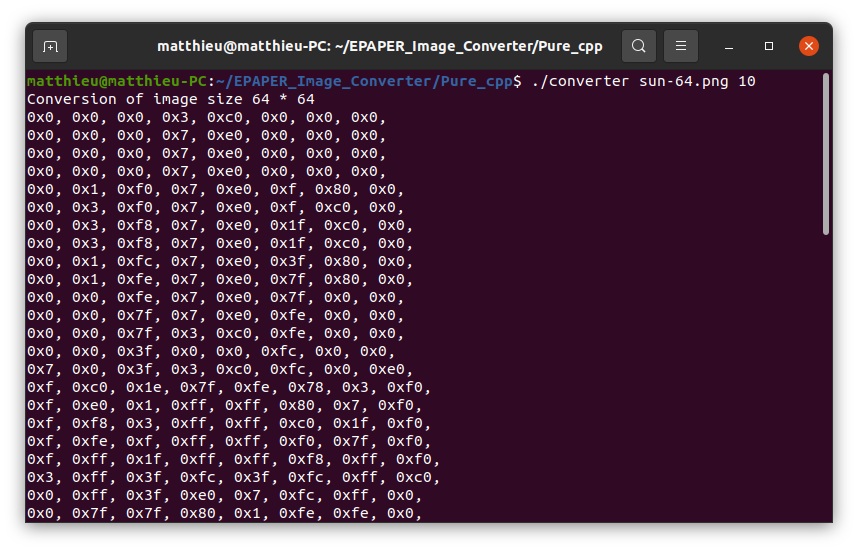

# EPAPER Image Converter
A solution to convert an image to a <b>EPAPER monochrome display</b> format.
The format used here is from left to top to bottom from left, to right, and by grouping <b>8 bits</b>. It has been develloped in parrallel with the library ESP8266_EPAPER_lib : https://github.com/mtribiere/ESP8266-EPAPER-Lib

You can choose beetween to options : an <b>UI-based</b>, and an <b>CLI-based</b>.

| Version | Screenshoot |
| :--: | :--: |
| QT_UI |  |
| Pure_CPP |  |

## QT_UI Version
### Compiling
Simply import the Qt project from the "QT_UI" folder inside your install of Qt, and press RUN on the bottom left.

### Running
Same as above or, 
```shell
cd /your/repo/clone/QT_UI/bin
./converter_ui
```

