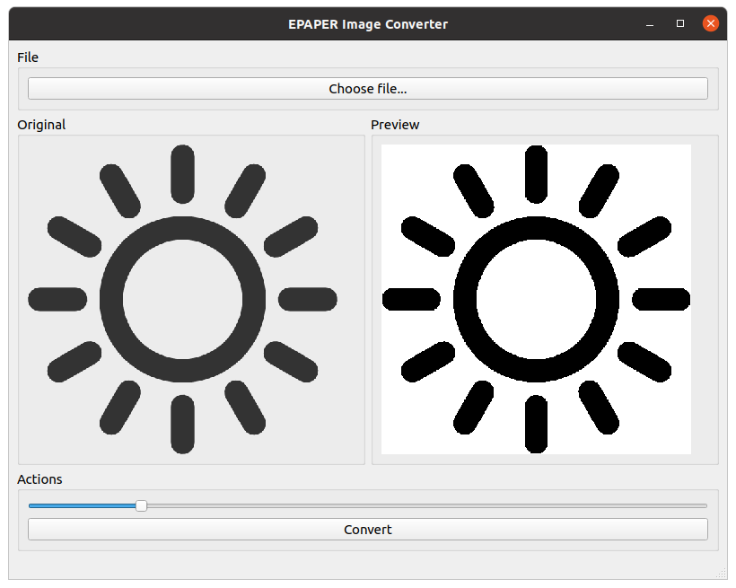

# EPAPER Image Converter
A solution to convert an image to a <b>EPAPER monochrome display</b> format.
The format used here is from left to top to bottom from left, to right, and by grouping 8 bits. It has been develloped in parrallel with the library ESP8266_EPAPER_lib : https://github.com/mtribiere/ESP8266-EPAPER-Lib

You can choose beetween to options : an <b>UI-based</b>, and an <b>CLI-based</b>.

| Version | Screenshoot |
| :--: | :--: |
| QT_UI |  |
| Pure_CPP |  |
